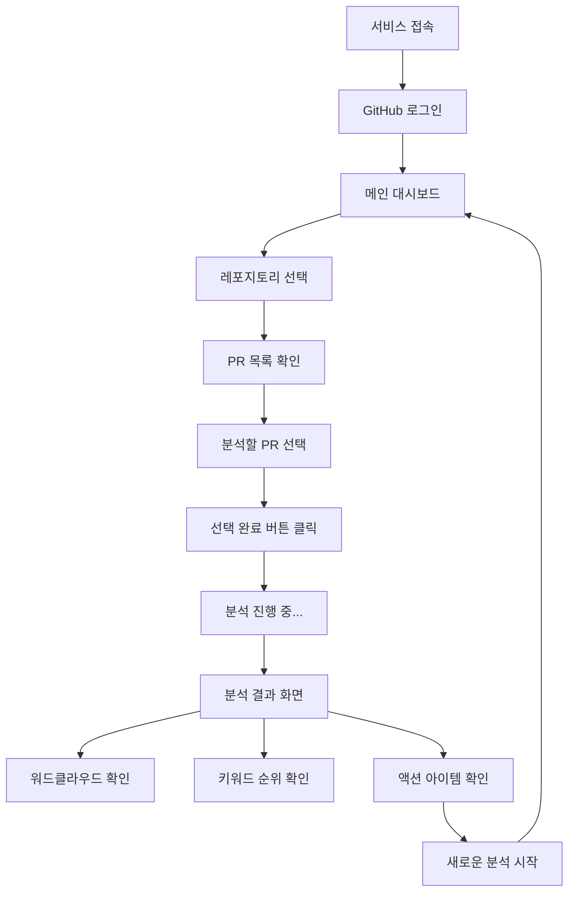

## 📋 서비스 개요

### 서비스명

**Review - Re-view**

코드 리뷰(Review)를 전반적으로 다시(Re) 돌아본다(View)는 의미

### 목적

GitHub PR 코멘트를 자동 분석하여 개발자의 코드 품질 개선점과 구체적인 액션 아이템을 제시하는 서비스

### 핵심 가치

- **패턴 인식**: 반복되는 리뷰 포인트 자동 식별
- **개선 가이드**: 데이터 기반 개선 방향 제시
- **생산성 향상**: 셀프 리뷰 품질 향상으로 리뷰 사이클 단축

---

## 🔄 유저 플로우



---

## 🖥 화면별 기능 명세

### 1. 로그인 화면

### 📍 화면 구성

- **헤더**: 서비스 로고 + 타이틀
- **메인 영역**: GitHub 로그인 버튼 (중앙 정렬)
- **푸터**: 서비스 소개 및 연락처
  - 서비스 소개 (앞서 작성한 서비스 목적에 맞게 사용을 유도하는 문구)
  - 연락처: 개발자 프로필 (https://github.com/SangWoo9734) 텍스트 노출 및 링크 연동

### ⚡ 주요 기능

- **GitHub OAuth 로그인**
  - GitHub 계정 연동 필수
  - 레포지토리 읽기 권한 요청
  - 로그인 성공 시 메인 화면으로 이동

### 🎨 UI 요소

```
┌─────────────────────────────────────┐
│           Review - Re-view          │
├─────────────────────────────────────┤
│                                     │
│         🔍 PR 코멘트 분석으로        │
│       더 나은 코드를 만들어보세요      │
│                                     │
│     [🐙 GitHub으로 로그인하기]        │
│                                     │
│   • (서비스 소개 및 기능 소개)        │
│     • PR 코멘트 자동 분석            │
│     • 개선점 시각화                 │
│     • 맞춤형 액션 아이템 제공         │
│   • 개발자 프로필 링크               │
│     github.com/SangWoo9734         │
│                                     │
└─────────────────────────────────────┘

```

---

### 2. 메인 대시보드

### 📍 화면 구성

- **헤더**: 사용자 정보 + 로그아웃 버튼
- **사이드바**: 레포지토리 목록 (접을 수 있는 트리 구조)
- **메인 영역**: 선택된 레포의 PR 카드 리스트
- **하단 액션**: 선택된 PR 개수 + 분석 시작 버튼

### ⚡ 주요 기능

**레포지토리 관리**

- 사용자의 모든 레포지토리 표시 (public + private)
- 레포별 최근 PR 개수 표시
- 검색 기능으로 레포 필터링

**PR 카드 시스템**

- 레포별 PR 그룹화 표시
- 각 PR 카드 정보:
  - PR 제목 (최대 2줄)
  - 생성일/마지막 업데이트
  - 코멘트 개수 뱃지
  - 작성자 프로필
  - 상태 (Open/Merged/Closed)
- 다중 선택 지원 (체크박스)
- 날짜/코멘트 수 기준 정렬

**선택 및 분석**

- 선택된 PR 개수 실시간 표시
- 최소 1개 ~ 최대 5개 PR 선택 제한
- "선택 완료" 버튼으로 분석 시작

### 🎨 UI 레이아웃

```
┌─────────────────────────────────────────────────────────┐
│ 🏠 Review - Re-view    👤 username    [로그아웃]         │
├──────────┬──────────────────────────────────────────────┤
│📁 Repos  │                PR 목록                        │
│          │                                              │
│🔍[검색]   │  📋 my-awesome-repo                          │
│          │  ┌─────────────────────────────────────────┐  │
│📂 전체    │  │ ☑️ feat: 사용자 인증 기능 추가            │  │
│project-a │  │    👤 user1  📅 2024-01-15  💬 8       │  │
│project-b │  └─────────────────────────────────────────┘  │
│          │  ┌─────────────────────────────────────────┐  │
│          │  │ ☑️ fix: 메모리 누수 수정                 │  │
│          │  │    👤 user2  📅 2024-01-14  💬 12      │  │
│          │  └─────────────────────────────────────────┘  │
│          │                                              │
└──────────┴──────────────────────────────────────────────┤
│           선택됨: 2개 PR      [📊 분석 시작하기]           │
└─────────────────────────────────────────────────────────┘

```

---

### 3. 분석 결과 화면

### 📍 화면 구성

- **헤더**: 분석 완료된 PR 정보 요약
- **탭 네비게이션**: 워드클라우드 / 키워드 분석 / 액션 아이템
- **메인 콘텐츠**: 탭별 분석 결과
- **사이드 패널**: 분석 통계 요약

### ⚡ 주요 기능

**📊 Tab 1: 워드클라우드**

- 인터랙티브 워드클라우드
- 키워드 클릭 시 관련 코멘트 하이라이트
- 카테고리별 색상 구분
- 크기는 언급 빈도에 비례

**📈 Tab 2: 키워드 분석**

- **최다 언급 키워드** (Top 10)
  - 키워드 + 언급 횟수 + 증감률
- **기술 키워드** (React, TypeScript 등)
  - 기술 스택별 분류
- **개선 영역** (성능, 구조, 품질 등)
  - 카테고리별 그룹화
  - 심각도별 색상 표시

**🎯 Tab 3: 액션 아이템**

- **즉시 실행 가능한 액션** (P1/P2 우선순위)
  - 목록 형태로 표시
  - 관련 리소스 링크
- **중장기 개선 과제** (P3/P4/P5 우선순위)
  - 로드맵 형태로 표시
- **우선순위 미분류 항목** 처리
  - 컨텍스트 기반 분석 결과 표시

**📋 사이드 패널**

- 분석된 PR 개수
- 총 코멘트 수
- 우선순위별 이슈 개수
- 우선순위 미분류 항목 개수

### 🎨 UI 레이아웃

```
┌─────────────────────────────────────────────────────────┐
│ 📊 분석 결과 | 5개 PR, 총 47개 코멘트 분석 완료            │
├─────────────────────────────────────────────────────────┤
│ [🌥 워드클라우드] [📊 키워드 분석] [🎯 액션 아이템]        │
├──────────────────────────────────┬──────────────────────┤
│                                  │   📋 분석 요약        │
│        워드클라우드 영역          │   • PR: 5개          │
│     (크기별로 키워드 표시)         │   • 코멘트: 47개      │
│                                  │   • 평균: 9.4개/PR   │
│     props   hook   useMemo       │   • P1 이슈: 8개     │
│                                  │   • P2 이슈: 15개    │
│   컴포넌트    타입    API         │   • P3 이슈: 12개    │
│                                  │                      │
│     유틸함수   상수   에러처리     │   🔥 Hot Keywords    │
│                                  │   1. props (12회)    │
│                                  │   2. hook (9회)      │
│                                  │   3. useMemo (7회)   │
│                                  │                      │
└──────────────────────────────────┴──────────────────────┤
│ [🔄 새 분석]                                            │
└─────────────────────────────────────────────────────────┘

```

---

## 🛠 기술적 고려사항

### Frontend

- **React** + TypeScript
- **Tailwind CSS** (UI 컴포넌트)
- **D3.js** (워드클라우드, 차트)
- **React Query** (API 상태 관리)

### Backend

- **Node.js** + Express
- **GitHub API** 연동
- **자연어 처리** (키워드 추출, 감정 분석)
- **PostgreSQL** (분석 결과 캐싱)

### 핵심 알고리즘

```jsx
// 코멘트 분석 파이프라인
1. GitHub API → PR 코멘트 수집
2. 텍스트 전처리 → 불용어 제거, 토큰화
3. 키워드 추출 → TF-IDF, 빈도 분석
4. 카테고리 분류 → 기술/품질/구조 등
5. 우선순위 산정 → P1~P5 레벨 분류
6. 액션 아이템 생성 → 룰 기반 + 머신러닝

```

---

## 🗓 개발 로드맵

### Phase 1: GitHub OAuth 인증 시스템 (1주)

**목표**: GitHub 인증 및 토큰 관리

**주요 기능**

- [ ] GitHub OAuth App 등록 및 설정
- [ ] Vercel Serverless Function으로 토큰 교환 엔드포인트 구축
- [ ] 프론트엔드 OAuth 플로우 구현
- [ ] 쿠키 기반 토큰 저장 및 관리
- [ ] 로그인/로그아웃 상태 관리

**기술 구현**

- GitHub OAuth App 생성 (Client ID/Secret)
- Vercel Functions: `/api/auth/github.js` 토큰 교환
- React Context로 인증 상태 관리
- 쿠키 기반 토큰 저장 (secure, httpOnly)
- 토큰 유효성 검증 및 갱신 로직

### Phase 2: 기본 UI 구성 및 라우팅 (1주)

**목표**: 기본 레이아웃과 라우팅 시스템 구축

**주요 기능**

- [ ] React + TypeScript + Vite 프로젝트 셋업
- [ ] Tailwind CSS 스타일링 시스템
- [ ] 로그인 화면 UI 구현
- [ ] 메인 대시보드 레이아웃 구성
- [ ] React Router 라우팅 설정

**기술 구현**

- Vite 빌드 도구 설정
- Tailwind CSS 커스텀 테마
- 반응형 레이아웃 컴포넌트
- Protected Route 컴포넌트
- 기본 컴포넌트 라이브러리 구축

### Phase 3: GitHub API 연동 및 데이터 수집 (1주)

**목표**: GitHub 데이터 수집 및 표시

**주요 기능**

- [ ] Octokit.js GitHub API 클라이언트 설정
- [ ] 사용자 레포지토리 목록 조회
- [ ] PR 목록 조회 및 필터링
- [ ] 레포지토리 검색 기능
- [ ] API 에러 핸들링 및 로딩 상태

**기술 구현**

- Octokit.js 클라이언트 사이드 구현
- React Query로 GitHub API 상태 관리
- 페이지네이션 및 무한 스크롤
- GitHub API Rate Limit 관리
- 에러 바운더리 및 fallback UI

### Phase 4: PR 선택 시스템 및 코멘트 수집 (1주)

**목표**: PR 선택 UI 및 코멘트 데이터 수집

**주요 기능**

- [ ] PR 카드 컴포넌트 구현
- [ ] PR 다중 선택 체크박스 시스템
- [ ] 선택된 PR 상태 관리 (최대 5개 제한)
- [ ] PR 코멘트 및 리뷰 코멘트 API 호출
- [ ] 분석 진행 상태 표시 및 프로그레스 바

**기술 구현**

- React Context로 PR 선택 상태 관리
- GitHub PR Comments & Review Comments API
- 비동기 데이터 수집 및 병렬 처리
- 프로그레스 바 및 로딩 애니메이션
- 선택 제한 검증 로직

### Phase 5: 클라이언트 사이드 텍스트 분석 엔진 (1주)

**목표**: 브라우저에서 코멘트 텍스트 분석

**주요 기능**

- [ ] 코멘트 텍스트 전처리 (불용어 제거, 토큰화)
- [ ] 한국어/영어 키워드 추출 알고리즘
- [ ] TF-IDF 가중치 계산
- [ ] 기본 카테고리 분류 (React, TypeScript, 성능 등)
- [ ] P1-P5 우선순위 패턴 인식

**기술 구현**

- 클라이언트 사이드 자연어 처리 라이브러리
- 정규표현식 기반 패턴 매칭
- 키워드 빈도 분석 및 가중치 계산
- 카테고리 매핑 룰 엔진 구현
- Web Worker를 활용한 백그라운드 분석

### Phase 6: 워드클라우드 시각화 (1주)

**목표**: D3.js를 활용한 인터랙티브 워드클라우드

**주요 기능**

- [ ] D3.js 워드클라우드 컴포넌트 구현
- [ ] 키워드 크기 및 색상 매핑
- [ ] 카테고리별 색상 구분 시스템
- [ ] 키워드 호버 및 클릭 이벤트
- [ ] 반응형 워드클라우드 레이아웃

**기술 구현**

- D3.js 워드클라우드 라이브러리 통합
- SVG 기반 렌더링 최적화
- 동적 색상 팔레트 시스템
- 이벤트 핸들링 및 툴팁 구현
- 모바일 터치 이벤트 대응

### Phase 7: 키워드 분석 대시보드 (1주)

**목표**: 구조화된 분석 결과 대시보드

**주요 기능**

- [ ] 최다 언급 키워드 랭킹 (Top 10)
- [ ] 기술 키워드 분류 및 카테고리별 표시
- [ ] 개선 영역별 그룹화 및 시각화
- [ ] 우선순위별 통계 차트
- [ ] 탭 기반 네비게이션 구현

**기술 구현**

- Chart.js 또는 Recharts 차트 라이브러리
- 데이터 그룹핑 및 정렬 알고리즘
- 탭 컴포넌트 및 상태 관리
- 색상 코딩 및 범례 시스템
- 반응형 차트 레이아웃

### Phase 8: 액션 아이템 생성 및 마무리 (1주)

**목표**: 액션 아이템 생성 및 전체 서비스 완성

**주요 기능**

- [ ] 우선순위별 액션 아이템 생성 로직
- [ ] 목록 형태 UI 구현 (체크리스트 제거)
- [ ] 우선순위 미분류 항목 처리 및 표시
- [ ] 새로운 분석 시작 플로우
- [ ] 전체 서비스 테스트 및 성능 최적화

**기술 구현**

- 룰 기반 액션 아이템 생성 엔진
- 컨텍스트 기반 우선순위 추정 로직
- 상태 초기화 및 플로우 관리
- 번들 사이즈 최적화 및 코드 스플리팅
- PWA 설정 및 오프라인 지원

---

### 🚀 배포 및 운영

**추가 1주**: 서비스 배포 및 모니터링 설정

**배포 환경**

- **Frontend + Serverless Functions**: Vercel
- **도메인**: 커스텀 도메인 연결
- **모니터링**: Vercel Analytics, Sentry (에러 추적)
- **성능**: Lighthouse CI 통합

**보안 설정**

- GitHub OAuth App 프로덕션 설정
- 환경변수 보안 관리 (Client Secret)
- CORS 정책 및 CSP 헤더 설정

**총 개발 기간: 8-9주**

---

_이 기획서는 초기 버전이며, 사용자 피드백을 통해 지속적으로 개선될 예정입니다._
